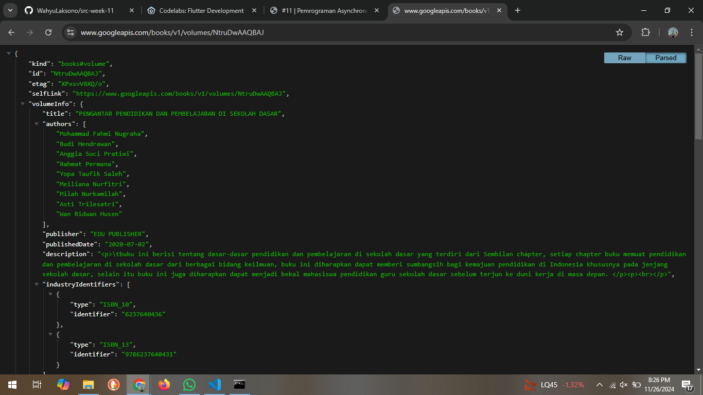
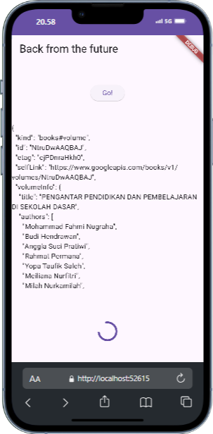

# books

A new Flutter project.

## Getting Started

# Wahyu Laksono Saputra || 362358302107

# Soal 1

# Soal 2

# Soal 3
substring(0, 450) : Mengambil potongan dari string tersebut, mulai dari indeks 0 hingga 450. Ini berarti hanya 450 karakter pertama dari respons yang akan disimpan dalam variabel result. Jika respons memiliki kurang dari 450 karakter, maka akan mengambil seluruh karakter yang ada. Ini sering digunakan untuk membatasi panjang teks yang ditampilkan agar tidak terlalu panjang.

catchError((_) {..}): Ini adalah callback yang akan dijalankan jika terjadi kesalahan saat menjalankan getData().

